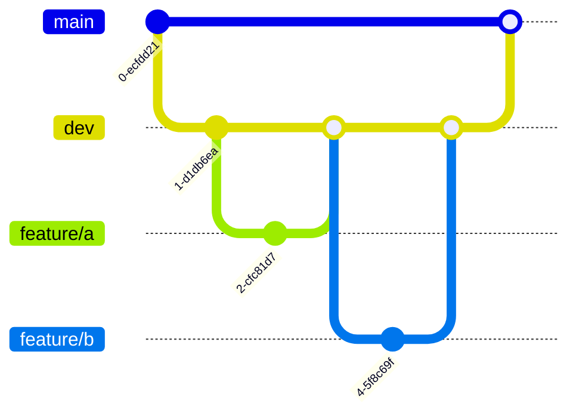

# Smart-Dev — 智能多Agent协作开发团队

一个 Claude Code 插件，由5个专业 Agent 组成的虚拟开发团队，覆盖从需求分析到生产部署的完整开发生命周期。

## 团队角色

| 角色 | Skill | 职责 |
|------|-------|------|
| 💼 **技术主管** | `/smart-dev` | 协调团队、设计架构、管理分支、把控全流程 |
| 📋 **需求分析师** | `/analyst` | 深度挖掘需求、反复确认达成共识、输出结构化需求文档 |
| 💻 **软件工程师** | `/engineer` | 分派开发任务、独立分支编码、合并 dev 分支 |
| 🔒 **安全专家** | `/security` | 白盒代码审查、黑盒渗透测试、输出风险报告 |
| 🚀 **运维实施** | `/ops` | 部署上线、生成回退方案、应急预案 |

## 工作流


每个阶段完成后向用户汇报并等待确认，支持中断后从中断点恢复。

## 安装

```bash
# 克隆插件仓库
git clone https://github.com/ChenHao96/smart-dev.git

# 注册为 Claude Code 本地插件
claude plugins register .
```

## 使用方式

```
/smart-dev   启动完整开发流程，技术主管将协调整个团队
/analyst     直接启动需求分析师
/engineer    直接启动软件工程师
/security    直接启动安全专家
/ops         直接启动运维实施
```

## 阶段说明

### 阶段1: 需求分析
需求分析师对用户需求进行多维度调研（功能需求、非功能需求、数据模型、UI/UX、集成需求、运维需求），反复确认直到达成共识，生成结构化需求文档 `docs/smart-dev/requirements.md`。

### 阶段2: 技术设计
技术主管基于需求文档完成技术栈选型、架构设计（Mermaid 图表）、模块划分、API 接口设计和开发排期，生成技术报告 `docs/smart-dev/architecture.md`，并创建 `dev` 分支。

### 阶段3: 编码开发
技术主管根据任务依赖关系调度软件工程师（串行或并行），每个工程师从 dev 创建 `feature/<任务名>` 分支独立开发，完成后合并回 dev。

### 阶段4: 安全审查
安全专家对 dev 分支变更代码进行白盒审查（注入漏洞、认证授权、敏感数据、XSS/CSRF、依赖安全、配置安全、文件安全7大维度）和黑盒渗透测试，生成风险报告 `docs/smart-dev/security-report.md`。中/高风险问题交由工程师修复后重新审查，通过后合并 dev → main。

### 阶段5: 生产部署
运维实施从 main 分支部署，执行部署前检查清单，生成包含回退方案和应急预案的部署文档 `docs/smart-dev/deployment.md`，部署完成后进行健康检查、冒烟测试和监控确认。

## Git 分支策略



- **main**: 生产主干，只从 dev 合并
- **dev**: 开发主干，所有 feature 分支从此创建
- **feature/\<name\>**: 独立功能分支，完成后合并到 dev

## 交付物

所有文档输出到 `docs/smart-dev/` 目录：

| 文件 | 内容 | 产出阶段 |
|------|------|----------|
| `requirements.md` | 结构化需求文档 | 阶段1 |
| `architecture.md` | 技术架构报告 | 阶段2 |
| `security-report.md` | 安全审查报告 | 阶段4 |
| `deployment.md` | 部署文档与应急预案 | 阶段5 |
| `summary.md` | 项目总结报告 | 全部完成后 |

## 依赖

- Claude Code
- Git